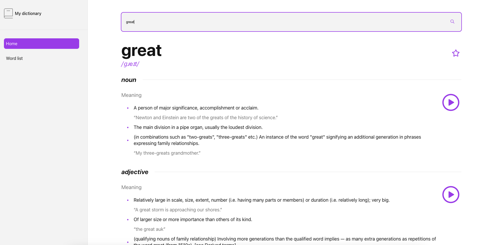
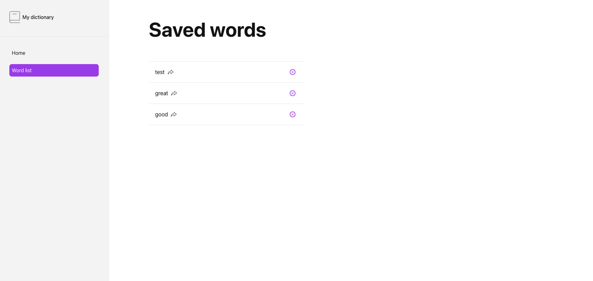

# Static resource

The only static resource for this application is the `logo.svg` file. The logo is a simple SVG file that is used as the logo for the application. 

A duplicate copy of the same file can be found in the `src` folder.

# Dictionary APIs

You will be using [Free Dictionary API](https://dictionaryapi.dev/) to fetch definitions of words.

The basic syntax of a URL request to the API is shown below:

* https://api.dictionaryapi.dev/api/v2/entries/en/<word>

# Color palette

Here is a set of colors that you are required to use in your application:

* hsl(0, 0%, 100%) // white
* hsl(0, 0%, 96%) // light grey
* hsl(0, 0%, 18%) // black
* hsl(0, 0%, 51%) // grey
* hsl(0, 0%, 91%) // light grey: used for separators
* hsl(274, 82%, 60%) // purple
* hsl(0, 100%, 66%) // red

You can refer to the following two images to see how these colors are used in the application:

